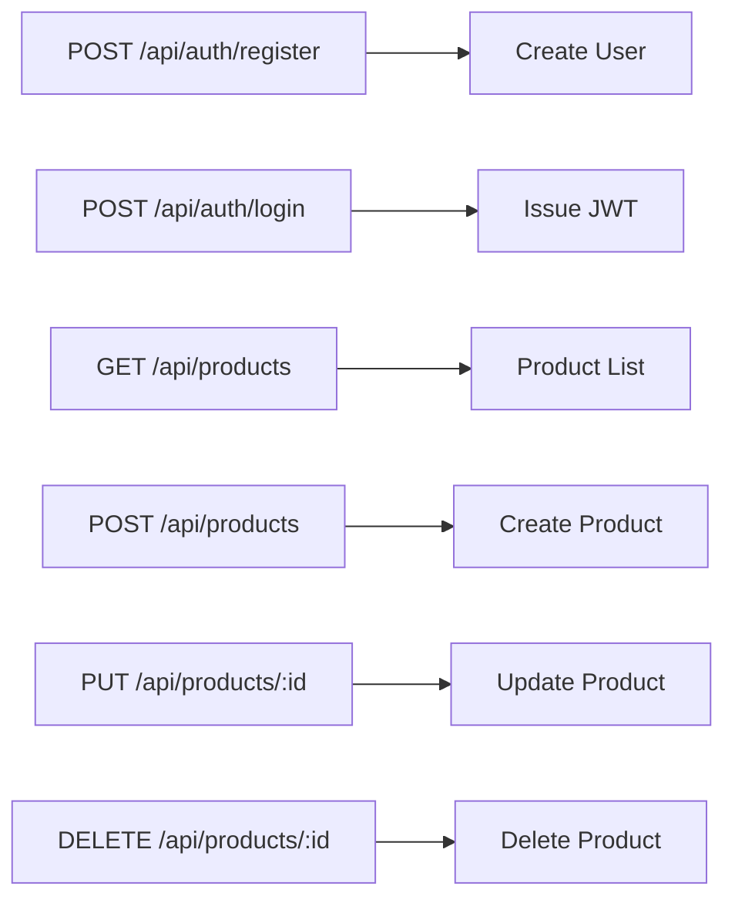

# Backend - Bull-Mart

---

<p align="center">
  
  
  
</p>

---

## 🏗️ Backend Architecture

```mermaid
flowchart TD
  FE[Frontend (React)] -- REST API --> BE[Backend (Express)]
  BE -- MongoDB Driver --> DB[(MongoDB)]
  BE -- JWT Auth --> User[User]
  BE -- CRUD --> Product[Product]
```

---

## 🔌 API Endpoints



---

## 🔒 Authentication Flow

1. User registers or logs in via `/api/auth` endpoints.
2. On login, backend issues a **JWT** (JSON Web Token).
3. Protected routes require `Authorization: Bearer <token>` header.
4. Middleware validates JWT and enforces role-based access (user/admin).

---

## 🗄️ Data Models

- **User:** name, email, password (hashed), role, location, createdAt
- **Product:** name, description, price, location, createdBy, createdAt

---

## ⚡ Quickstart

```sh
cd backend
cp .env.example .env # Add your MongoDB URI and JWT secret
npm install
npm run dev
```

---

## 🧩 Integration

- Exposes REST APIs for the frontend React app
- Handles authentication, product CRUD, and location data
- Connects to MongoDB for persistent storage

---

## 📞 Contact

For backend issues, open an issue or contact the maintainer. 